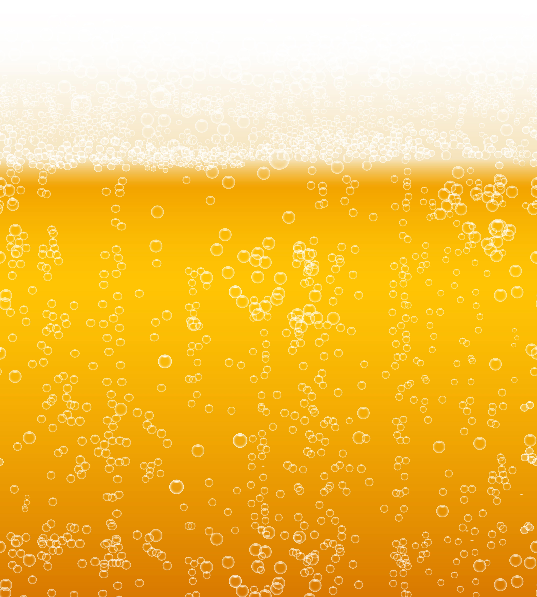

# Premium Beer Experience 🍺

Experience the virtual joy of drinking beer with this interactive web application. Tilt your device to drink, watch the beer level change in real-time, and enjoy immersive sound effects.

**[Live Demo](https://beerisbest2.vercel.app/)**



## Features

- **Interactive Tilting**: Tilt your device to simulate drinking the beer
- **Realistic Beer Visualization**: Beautifully rendered beer glass with foam and liquid physics
- **Responsive Design**: Looks great on mobile devices and desktops
- **Dynamic Sound Effects**: Different sounds based on how you tilt (gentle sips vs. big gulps)
- **Premium User Interface**: Sophisticated design with elegant animations
- **No Installation Required**: Works directly in your browser

## How to Use

1. Visit the [Live Demo](https://beerisbest2.vercel.app/) or run locally
2. Allow device orientation access when prompted (for mobile devices)
3. Tilt your device forward (like drinking) to see the beer level go down
4. Use the "Refill Beer" button when empty
5. Enjoy the realistic sound effects!

## Technology Stack

- **React**: Frontend UI library
- **TypeScript**: Type-safe JavaScript
- **Vite**: Fast build tooling
- **DeviceOrientation API**: For detecting device tilt
- **CSS Animations**: For fluid beer movement
- **Web Audio API**: For sound effects

## Development

### Prerequisites

- Node.js 18+ and npm

### Local Setup

```bash
# Clone the repository
git clone https://github.com/b1rdmania/beerisbest.git
cd beerisbest

# Install dependencies
npm install

# Start development server
npm run dev
```

### Building for Production

```bash
# Create optimized production build
npm run build

# Preview production build
npm run preview
```

## Mobile Testing Tips

- For best experience, use a mobile device with gyroscope/accelerometer
- If testing on desktop, use Chrome DevTools device emulation with accelerometer support
- Allow permissions for device orientation when prompted

## Browser Compatibility

- Chrome (Android/iOS/Desktop): Full support
- Safari (iOS 13+): Full support
- Firefox: Partial support (may require enabling device orientation in settings)
- Edge: Full support

## Credits

- Beer texture image: Public domain
- Sound effects: Custom recorded

## License

MIT License

---

Developed with ❤️ by [b1rdmania](https://github.com/b1rdmania)
